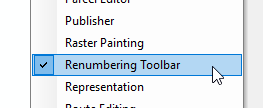

## Aggregate Zones
#### __version__ 0.1

This tool is to be used for aggregating zones by manual selection. From the selected features, the plugin will assign an incremented ID to the selected features.

> Mandatory: Your shapefile must contain a field named `NewID` . You must follow use of this tool with the *Merge* tool available in the same toolbar.

### Installation

- Double click the `.esriaddin` file and follow the instructions.
- Open ArcGIS and right click anyhwere in the empty toolbar space and select `Renumbering Toolbar`.  
- A toolbar with a button `Assign newID` is now available.

### Images
  

### Use 

#### Assign Button

- Bring the shapefile to the top of your TOC.
- Add a field `NewID` to your shapefile if it does not exist already.
- Edit mode is not required.
- Label the features on `NewID`.
- Select one or more features (but not all), and click the tool.
- If you have labelled the layer (step 4), you will notice the changes.

##### Errors

- No `NewID` field in your shapefile will result in an error.
- Not selecting any feature, the tool does nothing, (logs error invisible to the user).
- Selecting all features, the tool does nothing, (logs error invisible to the user).

#### Merge Button

- Once you have numbered all your zones, press Merge button.
- This dissolves zones based on the `NewID`.
- A new layer `DissolvedLayer` is created and loaded to your TOC.
- This layer is stored in `C:\Users\UserName\Documents\ArcGIS\Default.gdb`.

##### Errors

- New layer cannot be overwritten, make sure you rename your previous `DissolvedLayer`. This layer can be found in your default `C:\Users\UserName\Documents\ArcGIS\Default.gdb`.
